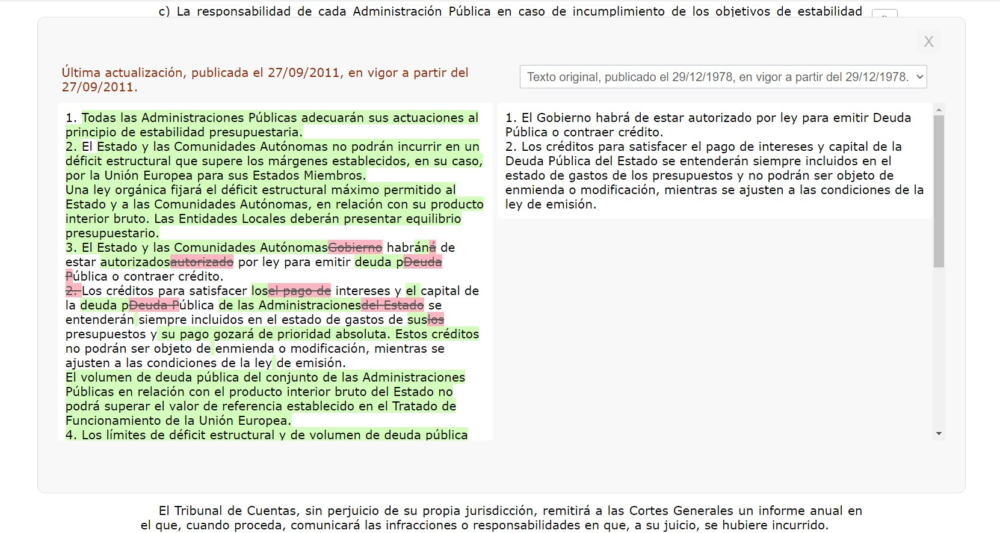

BOE Comparador. 
=======================================

## Sobre el proyecto

> Extensión web para analizar cambios legales inspirado en como vemos los cambios en el código los desarrolladores. :computer:  

## Guía para colaborar en el proyecto

Si eres desarrollador/a y quieres colaborar en el proyecto te dejo una serie de indicaciones que pueden serte útil:

- Haz un fork del proyecto y descárgalo en tu local para hacer tus cambios. En el proyecto puedes ver el código tanto para la extensión de Chrome como para Firefox (lo ideal sería tenerlo en el mayor número de navegadores para facilitar su uso). Si vas a añadir una nueva funcionalidad intenta, en la medida de lo posible, realizarlo para todos los navagadores para tener uniformidad. Ten en cuenta que aunque todo parte de los lenguajes de la web (HTML, CSS y JavaScript) hay diferencias entre navegadores (ej. versiones de los manifest.json).
###
- Si no has desarrollado una extensión web antes, tranquil@, yo es la primera extensión que publico, al final es HTML, CSS y Javascript. Tienes que ir a [chrome://extensions/](chrome://extensions/), activar el "Modo desarrollador" (arriba a la derecha), pulsar en "cargar descomprimida" y subir la carpeta del proyecto.
###
- Una vez instalada la extensión sobre la que vas hacer tus cambios en tu navegador te rediriges a [https://www.boe.es/buscar/act.php?id=BOE-A-1985-12666](https://www.boe.es/buscar/act.php?id=BOE-A-1985-12666). Debajo de cada artículos verás un botón llamado "Comparar" que al ser pulsado se abre un popup comparando las versiones de ese artículo. 
###
- Siéntete libre para realizar cambios en la extensión, ya sean de refactorizar código (es la primera extensión que hago, seguro que hay mucho margen de mejora), añadir funcionalidades o mejorar rendimiento. 
###
- Por último, cuando tengas los cambios, los Pull Request están abiertos :smile:. Mi idea es (si me da la vida :sleeping:) compartir las funcionalidades que se proponen, por ejemplo, en Twitter y valorar si lo añadimos o no al proyecto.

#
Te dejo por aquí un vídeo del funcionamiento de la extensión. 

")

Cualquier duda sobre el proyecto o como colaborar puedes contactarme aquí.

### URL del proyecto
[https://elboe.es](https://elboe.es).
